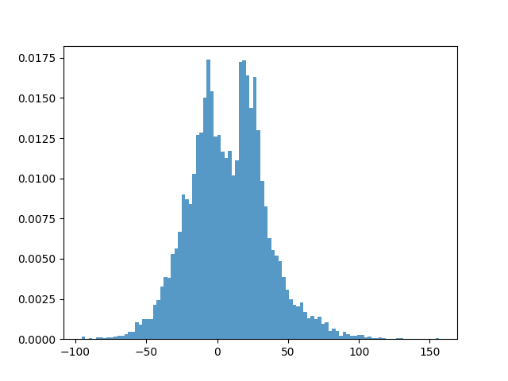
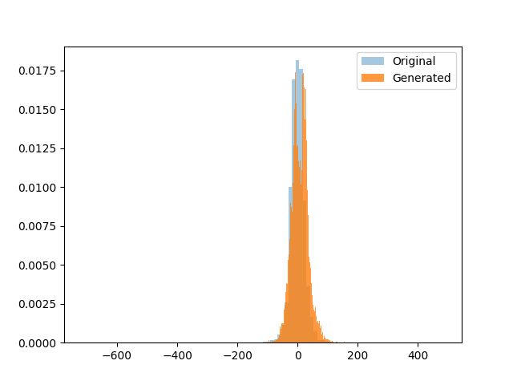

# Probability Density Estimation using Generative Adversarial Networks

## Overview

This project develops a **Generative Adversarial Network (GAN)** in PyTorch to approximate the probability density function (PDF) of a nonlinear transformation applied to environmental air quality measurements.

The model is trained on transformed nitrogen dioxide (`no2`) values extracted from the **India Air Quality dataset** available on Kaggle.

Dataset source:
[https://www.kaggle.com/datasets/shrutibhargava94/india-air-quality-data](https://www.kaggle.com/datasets/shrutibhargava94/india-air-quality-data)

The objective is to train a generator that produces synthetic samples whose distribution closely matches the transformed real data distribution.

## Data Processing

The `no2` column is extracted from the dataset, cleaned by removing missing values, and reshaped into a column vector.

A nonlinear transformation is applied to construct the target variable:

```
y = (x + a) * sin(b * x)
```

Where:

- `roll_number = 102303246`
- `a = 0.5 × (roll_number mod 7)`
- `b = 0.3 × ((roll_number mod 5) + 1)`

To improve training stability and reduce sensitivity to outliers, the transformed data is normalized using `RobustScaler` from scikit-learn.

## Model Architecture

A standard GAN framework is implemented consisting of two neural networks trained in opposition:

### Generator Network

- Input: 1-dimensional Gaussian noise
- Hidden layers:
  - Fully connected (1 → 32)
  - ReLU activation
  - Fully connected (32 → 32)
  - ReLU activation

- Output layer:
  - Fully connected (32 → 1)

The generator learns to map random noise to synthetic samples resembling the real distribution.

### Discriminator Network

- Input: 1-dimensional sample
- Hidden layers:
  - Fully connected (1 → 32)
  - ReLU activation
  - Fully connected (32 → 32)
  - ReLU activation

- Output layer:
  - Fully connected (32 → 1)
  - Sigmoid activation

The discriminator estimates the probability that an input sample is real rather than generated.

## Training Logs

```
Step 0    | D Loss: 1.3913 | G Loss: 0.7838
Step 500  | D Loss: 1.3819 | G Loss: 0.6916
Step 1000 | D Loss: 1.3838 | G Loss: 0.6901
Step 1500 | D Loss: 1.3827 | G Loss: 0.7033
Step 2000 | D Loss: 1.3880 | G Loss: 0.6910
Step 2500 | D Loss: 1.4446 | G Loss: 0.6863
Step 3000 | D Loss: 1.3842 | G Loss: 0.7019
```

The discriminator loss stabilizes around 1.38–1.44, while the generator loss remains near 0.69–0.70. This indicates a near-equilibrium condition where the discriminator struggles to confidently distinguish real from generated samples, suggesting stable adversarial training.

## Synthetic Data Generation

1. 10,000 noise samples are drawn from a Gaussian distribution.
2. The generator produces synthetic outputs.
3. The outputs are inverse-transformed to the original scale using the fitted scaler.

## Visualizations

### 1. Estimated Distribution



### 2. Real vs Generated Comparison


